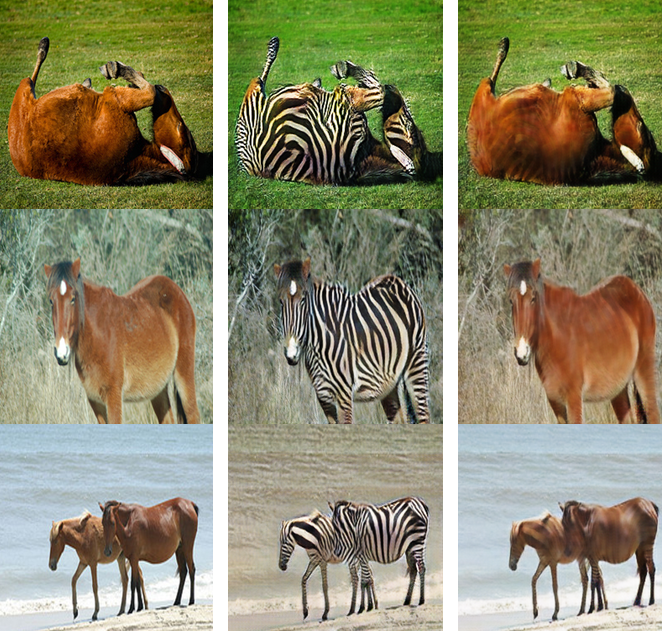

# CycleGAN implementation in PyTorch from scratch

This is a PyTorch implementation of CycleGAN, a general-purpose image-to-image translation network. The original paper can be found [here](https://arxiv.org/abs/1703.10593). The implementation is based on the YouTube video series by [Aladdin Persson](https://www.youtube.com/watch?v=4LktBHGCNfw).

